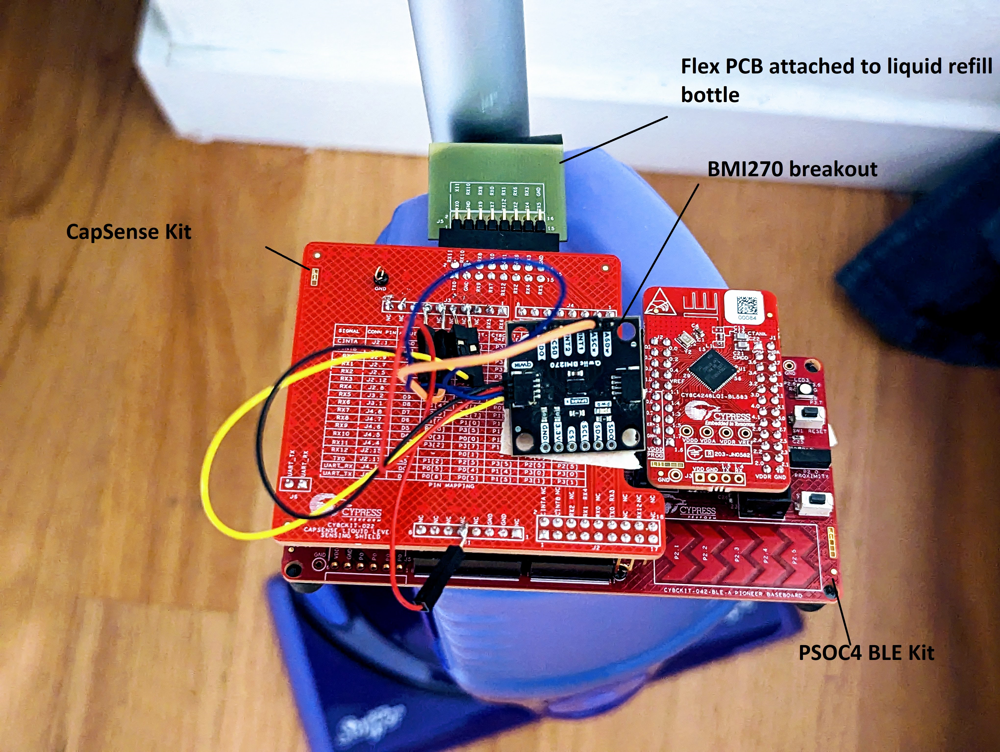
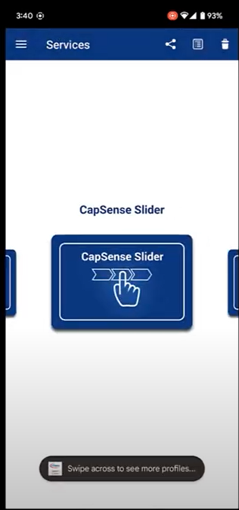
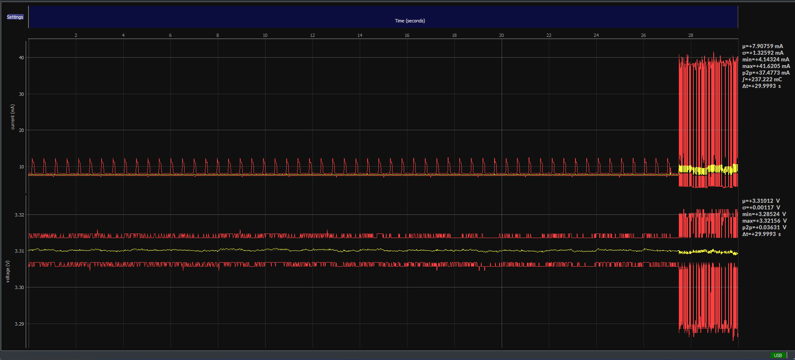
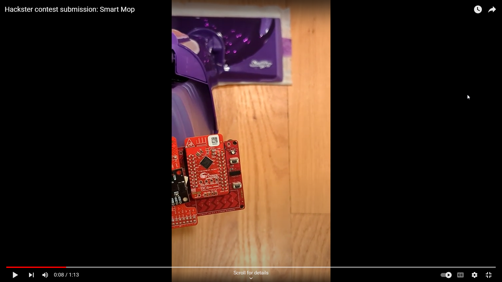

# Bluetooth-Enabled Smart Mop using the PSOC BLE pioneer kit

A Bluetooth enabled smart mop that tracks liquid refill levels using CapSense Technology.

A detailed writeup is available from [here](https://www.hackster.io/yamanoorsai/bluetooth-enabled-smart-mop-using-the-psoc-ble-pioneer-kit-8d9399).

 
## Folder structure

1. SmartMop.cydsn - Project workspace for smart mop
2. hardware - PCB design files, Gerbers, and BoM

# Videos

Mobile App Demo

Power Profiling Demo

Smart Mop Demo

